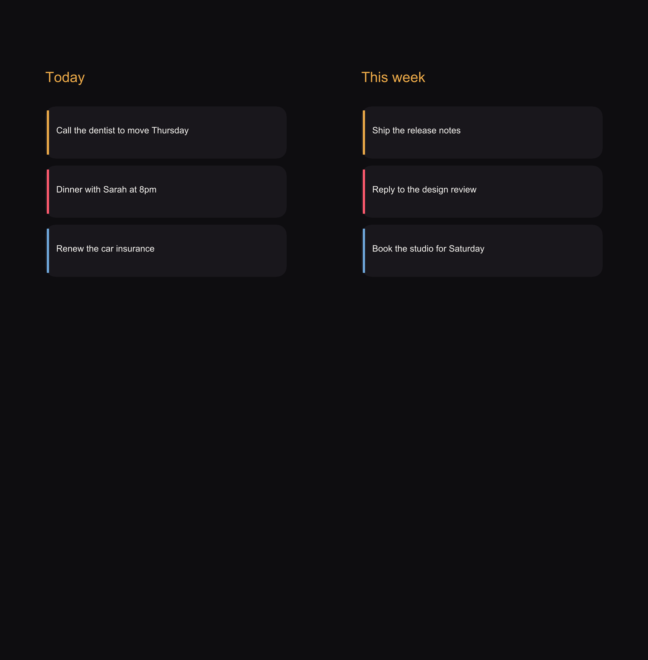

# Scaena

A local, offline, no-login **app-screen studio**. One Rust core, used from a **CLI**, an **MCP server**
(for AI agents), and a **browser GUI**. It captures, seeds, frames and exports app screens
reproducibly — including screens **behind an auth wall**, by seeding app state instead of signing in.

Zero AI, zero keys, zero network of its own. `adb` talks to a local emulator; nothing leaves the machine.



*(The image above was produced entirely by Scaena — `mock` + `frame` + `contact` — dogfooding the pipeline.)*

## Why

Producing app screenshots is a recurring chore, and every tool fails on one axis: Figma has a paid cap,
Claude Design is cloud-only and does not show the real running app, and a raw emulator cannot reach the
interesting screens (they sit behind a login or need seeded content). Scaena fills that gap: it drives
the real app and **seeds the exact state** needed, deterministically and offline.

## Install

```sh
cd scaena && ./install.sh        # builds release, symlinks `scaena` + `scaena-mcp` into ~/.local/bin
```
Requires the Rust toolchain and Android platform-tools (`adb`). iOS support uses `xcrun simctl`.

## CLI

```sh
scaena devices                                  # Android (adb) + iOS simulators (simctl)
scaena capture --out home.png                   # screenshot a device
scaena capture --host --out screen.png          # screenshot the macOS host (orange-dot scrubbed)
scaena flow flows/spocken.flow --out shots      # run a screen flow (below)
scaena snapshot com.x.app --out app.tar         # save an app's private state
scaena restore com.x.app app.tar                # replay it (no sign-in)
scaena frame home.png --out framed.png          # wrap in a device frame
scaena export framed.png --store play --out pk  # store-dimension-compliant pack
scaena tokens Theme.kt                           # import brand colors -> JSON
scaena serve --port 7777                         # browser GUI at http://127.0.0.1:7777
```

## Flows

A flow is a small line-DSL that drives an app to the screens you want and captures them:

```
launch   com.x.app com.x.app.MainActivity
wait     5000
seed     store.json  fixtures/notes.json    # write app-private files via run-as (no sign-in)
tap      540 400
key      KEYCODE_BACK
deeplink myapp://home
capture  home
stop
```

## Session-replay (screens behind auth)

For a screen behind a login, Scaena never authenticates. Instead: **you sign in once**, then

```sh
scaena snapshot com.x.app --out signed-in.tar   # record the signed-in app state
scaena restore com.x.app signed-in.tar          # replay it forever, no sign-in
```

## MCP (for agents)

`scaena-mcp` is a pure-Rust stdio JSON-RPC MCP server exposing `devices`, `capture`, `capture_host`,
`seed`, `snapshot`, `restore`, `flow`, `frame`, `export`, `tokens`. `capture` returns the screenshot
inline. See [MCP.md](MCP.md) to register it in Claude Code.

## Layout

- `crates/scaena-core` — the engine (devices, capture, flow, snapshot, render, tokens). Thin deps only.
- `crates/scaena-cli` — the `scaena` binary + the `serve` browser GUI.
- `crates/scaena-mcp` — the MCP server.

Built with the autoresearch loop (`../program.md`); progress in `../results.tsv` and `../PROGRESS.md`.
